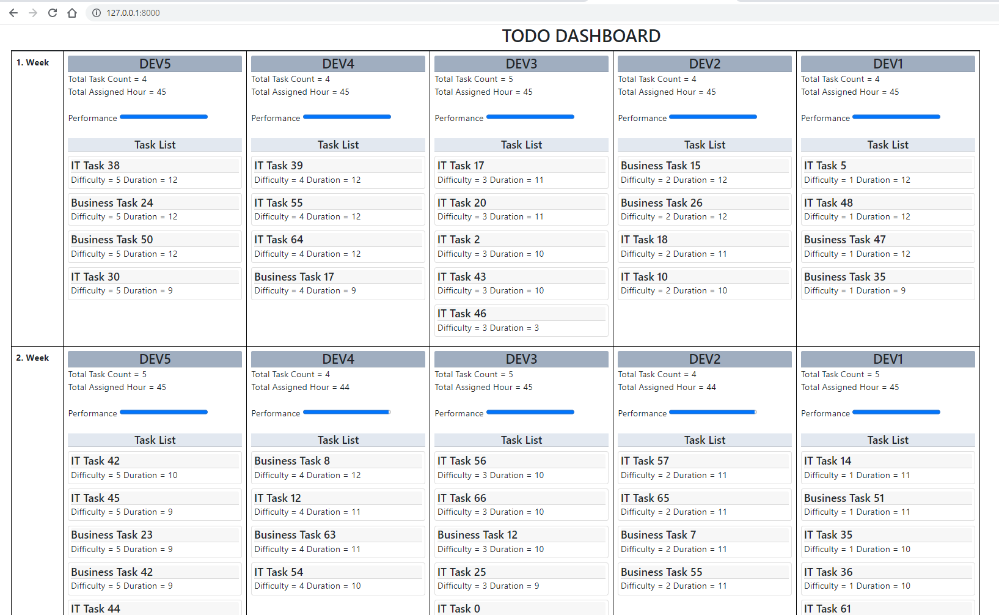
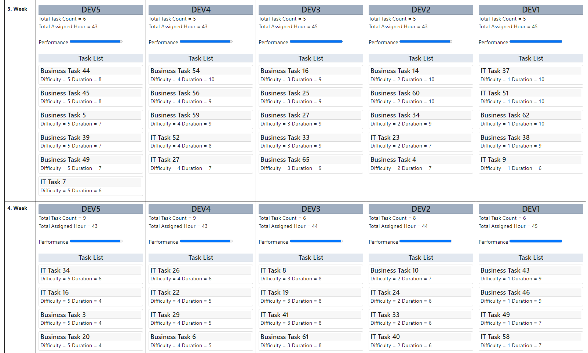
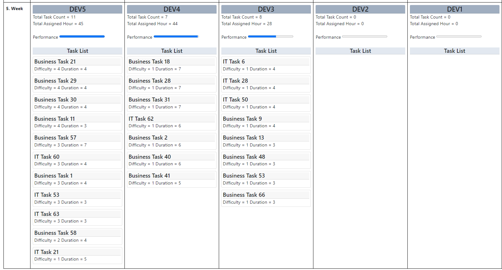

# To-Do Planning

```shell
php verison => 8.0
laravel verison => 9.x
```

```shell
crate db todo_case

ENV Example
DB_CONNECTION=mysql
DB_HOST=127.0.0.1
DB_PORT=3306
DB_DATABASE=todo_case
DB_USERNAME=root
DB_PASSWORD=
```

Steps
```shell
composer install
```

```shell
php artisan migrate
```

```shell
php artisan db:seed
```

```shell
php artisan command:createTodoList
```

```shell
php artisan serve
```

Route:
```shell
view => http://127.0.0.1:8000
```

Images



